# Application Flutter - Marché en ligne

Groupe : Antoine Barbier et Matthieu Commins

## Les fonctionnalités
L'application marché en ligne contient les fonctionnalités suivantes : 
- Les produits sont rangées par departements et catégories,
- Visualisation/creation/suppression/edition de listes de produits (si l'utilisateur est connecté),
- Ajout/suppression/edition d'un item au panier,
- Ajouter une liste de produit dans le panier,
- Recherches de produits,
- Drag and Drop d'un produit dans le panier
- Mode sombre et clair (automatique en fonction du mode de l'appareil).
- Les données sont stockées sur firebase.
- ...


## Informations

L'application fonctionne avec une base de données Firebase configuré pour : ```android et web.```

## Images du projet

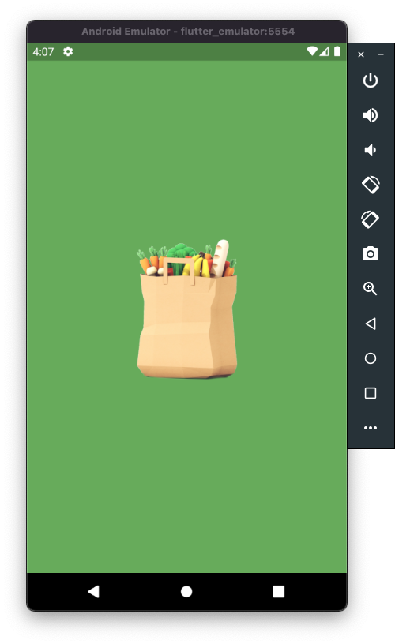
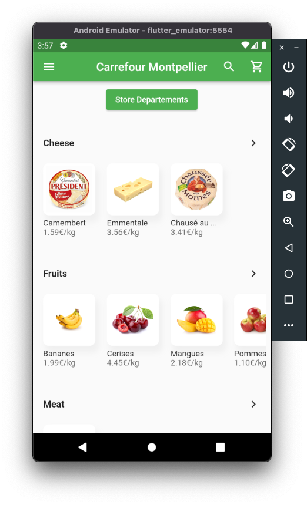
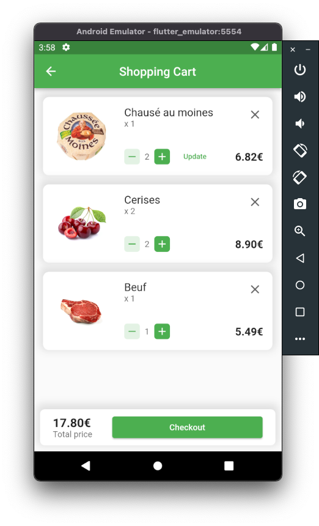
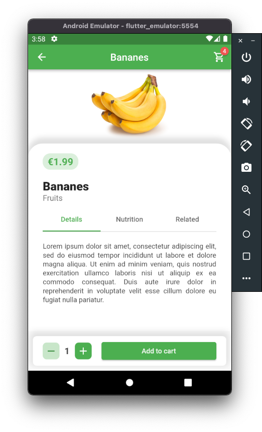
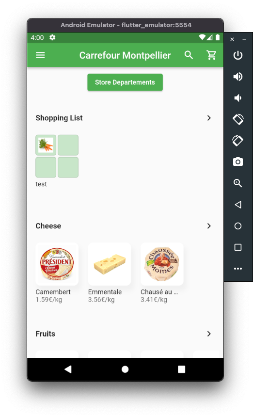
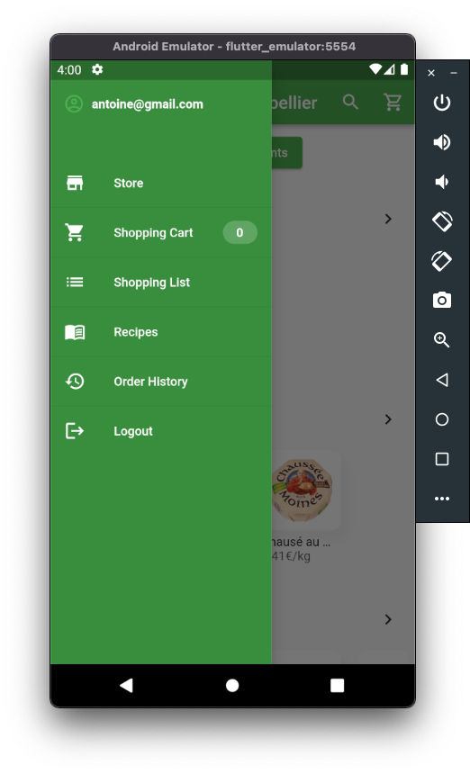
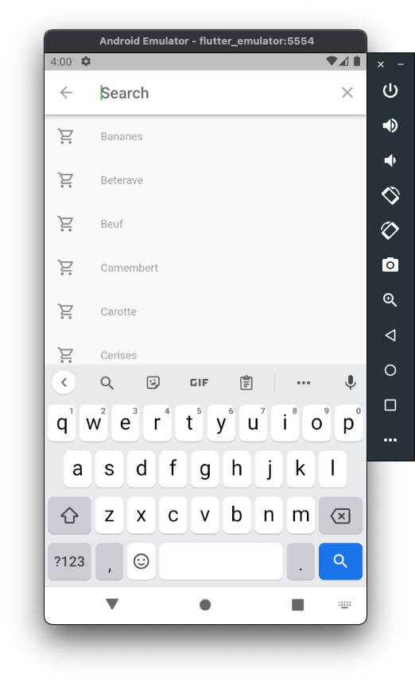
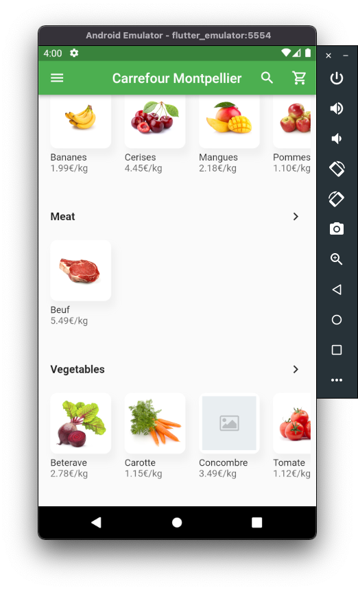
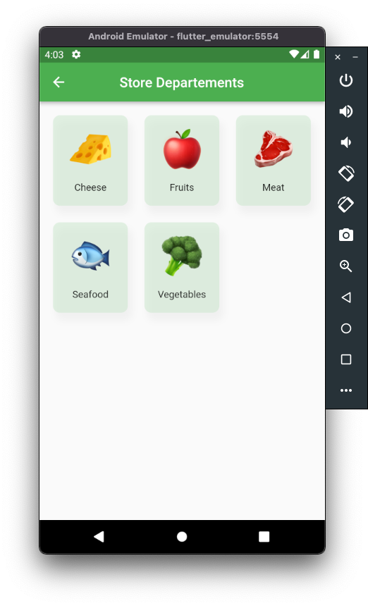

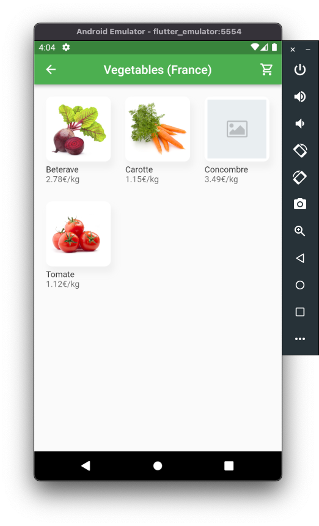
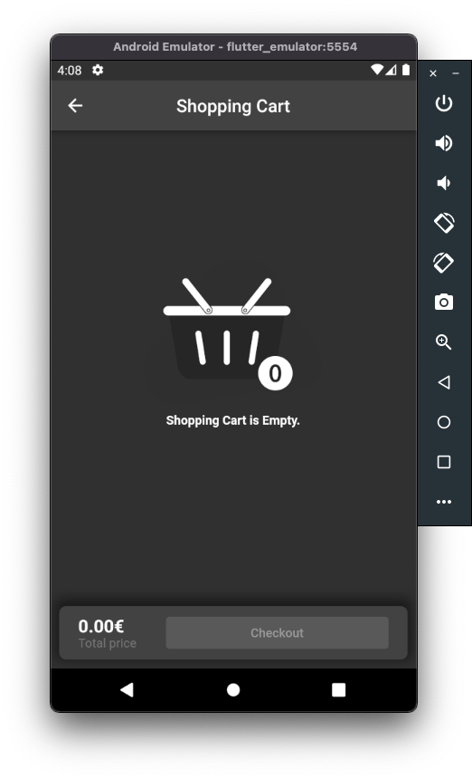
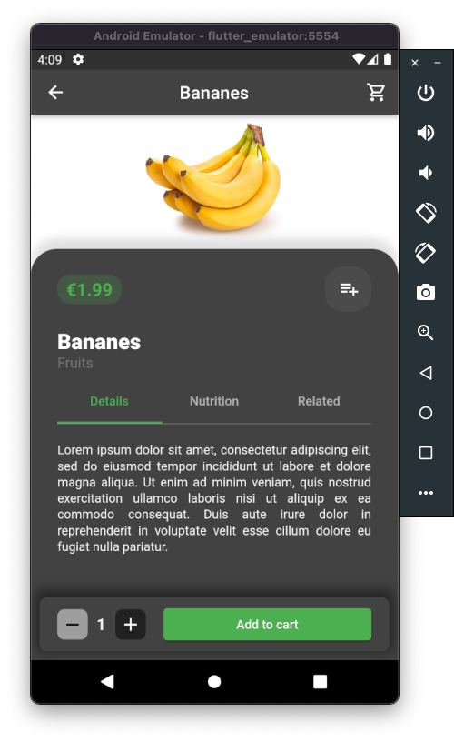
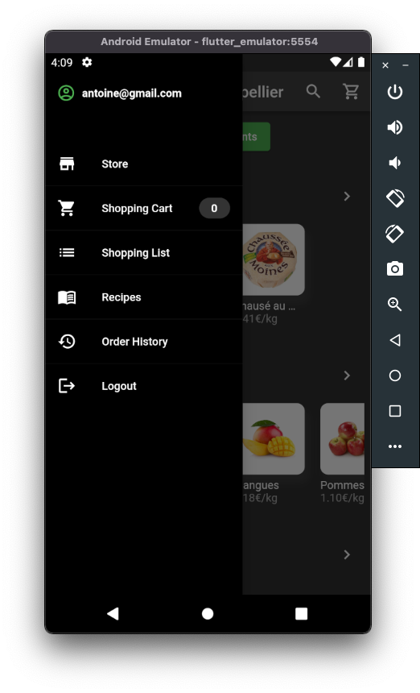
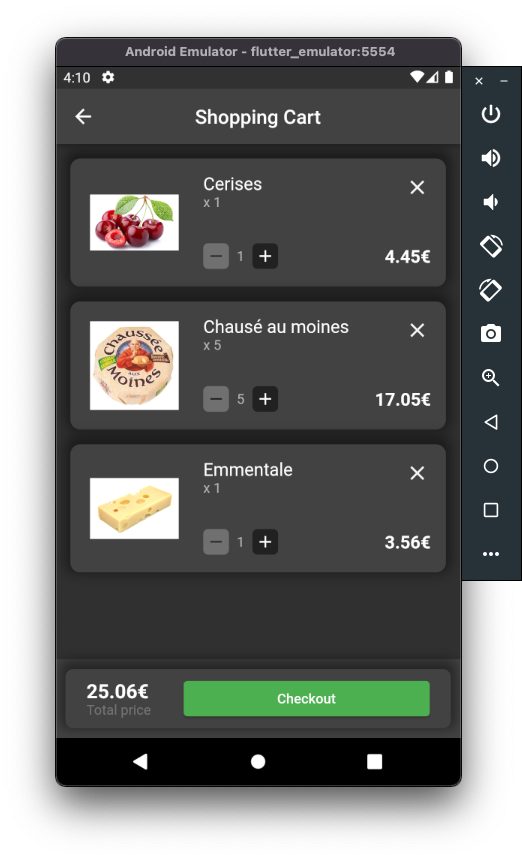
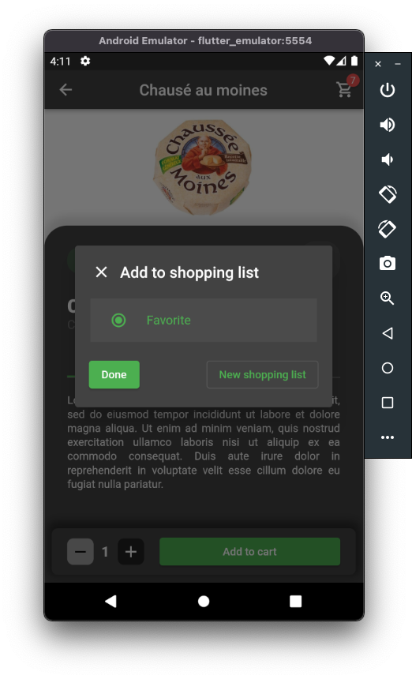
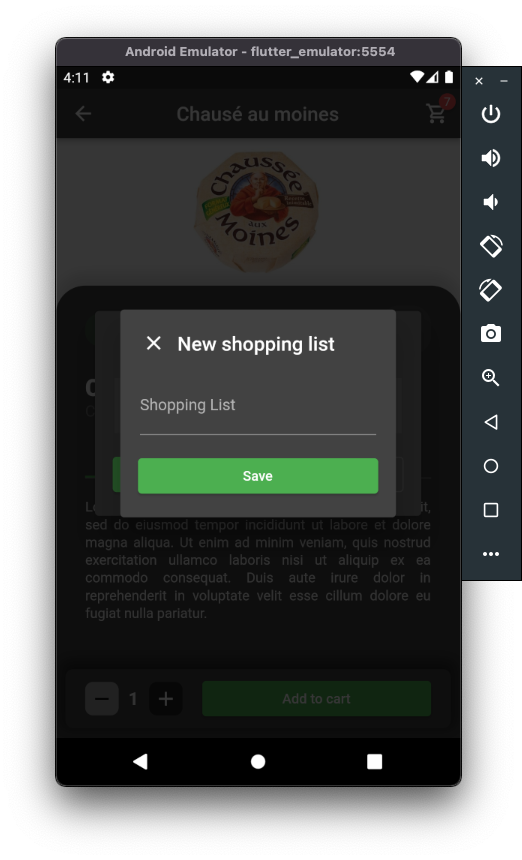
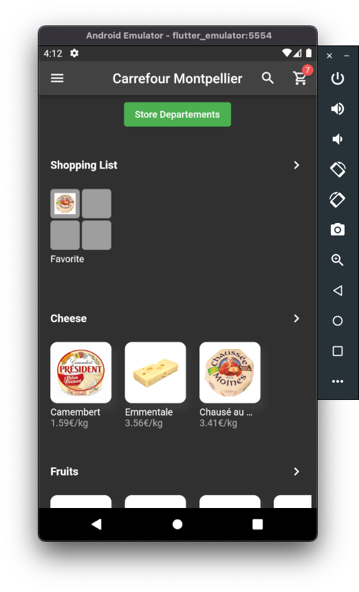
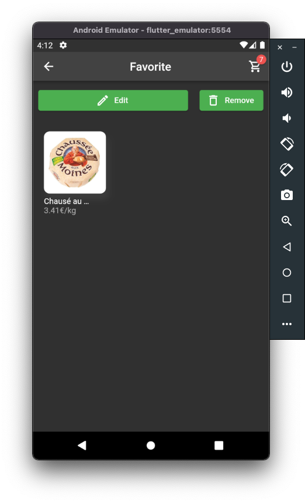
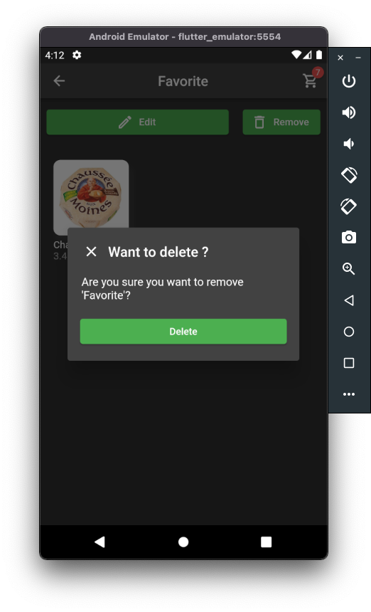


